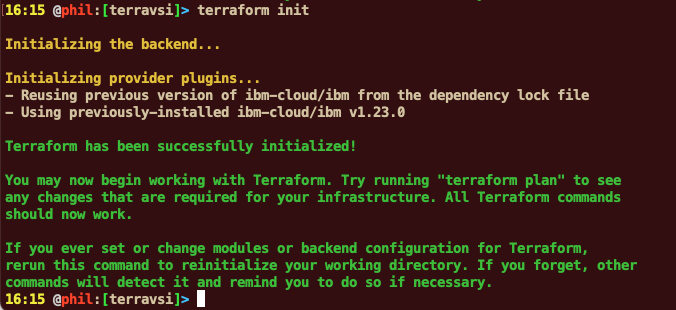
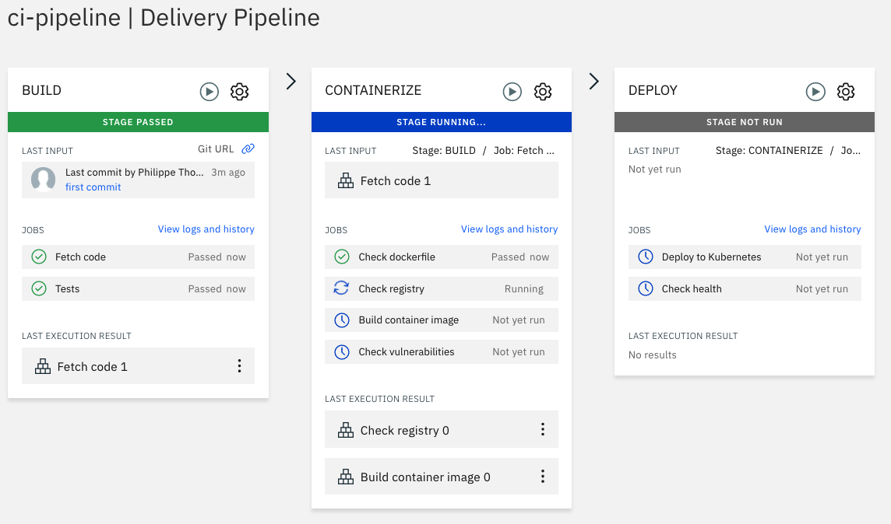

# Testing IBM Cloud Satellite on IBM Cloud with Terraform


In this document, we are defining a new satallite location, some virtual servers (with terraforms) and finally an OpenShift Cluster on that location. 


## 1-Defining the Satellite Location

This first step concerns the IBM Cloud Satellite Location. It is an easy and quick definition. 

First login into your IBM Account (be sure you have all the necessary permissions to create a satellite location and a few virtual server instances) :

`https://cloud.ibm.com`


Then once connected, click on **Catalog** and search for 


Click on the Satellite tile:


Click on the **Create a Satellite location**:


Be sure that the **Manual Setup** has been selected as shown below:


Click the **Edit** button on the right side:


Fill the different information in the form:

- name of the **location**: `nicelocation`  if you change the name then take a note of the new name that you specify.
- **Resource group** : specify the correct one for your organisation.
- I choose WDC for the datacenter where we want to install it (but you can choose another place).


Then click on the **Create Location** button on the right hand side:


You will a green progressing bar on the top (and after a while a yellow icon). While the creation is still in progress, you can go ahead with the next step: Click **Next**.


In the middle of the screen, you click a button to **Generate script**


Don't change the name of the script, click on **Download** button on the bottom right:


The script will be downloaded in your Downloads automatically. Take a note of the full path name of your script (**see below an example**)

```bash
/Users/phil/Downloads/attachHost-nicelocation.sh
```

For your laptop or on Windows it could be a different name for the begining of the path. 

> **IMPORTANT** : this script will be executed on each VM or VSI that you want to attach on you location. 

Before we can do that, you need to create the VSI (Virtual Server Instances) on IBM Cloud Classic Infrastructure. 


## 2-Using Terraform

There are several possibilities to define this VMs. For instance, you can manually go to the VSI Classic Infrastructure tile in the Catalog and create all the 6 VMs manually. 

We decided to choose another method with **Terraform**. 

https://cloud.ibm.com/docs/ibm-cloud-provider-for-terraform?topic=ibm-cloud-provider-for-terraform-setup_cli

If you don't have installed Terraform 0.12 or greater on your laptop, follow the steps:


#### a- Download Terraform binary file from the web site (choose a version like 13.6 or 14.10)

https://releases.hashicorp.com/terraform/


#### b- Unzip the file to get the "terraform" CLI binary file


#### c- Move this file to a directory that is already in your PATH (depending on Linux, MacOS or Windows) 


#### d- check terraform version: 

`terraform version`


#### e- Create a new directory like terrais and go to it:

`mkdir terravsi && cd terravsi  ` 


#### f- Define the IBM provider plugin version by using a version file : `nano versions.tf` ou `notepad versions.tf` and then specify the **IBM provider plugin version** (in my case 1.23.0)

File name : **versions.tf** 

``` terraform
 terraform {
   required_providers {
      ibm = {
         source = "IBM-Cloud/ibm"
         version = "1.23.0"
      }
    }
  }
```


#### g- The plugin will be automatically downloaded the **first time** you launch the terraform init command.

``` bash
terraform init
```

Results:

```bash
# terraform init

Initializing the backend...

Initializing provider plugins...
- Finding ibm-cloud/ibm versions matching "1.23.0"...
- Installing ibm-cloud/ibm v1.23.0...
- Installed ibm-cloud/ibm v1.23.0 (self-signed, key ID AAD3B791C49CC253)

Partner and community providers are signed by their developers.
If you'd like to know more about provider signing, you can read about it here:
https://www.terraform.io/docs/cli/plugins/signing.html

Terraform has created a lock file .terraform.lock.hcl to record the provider
selections it made above. Include this file in your version control repository
so that Terraform can guarantee to make the same selections by default when
you run "terraform init" in the future.

Terraform has been successfully initialized!

You may now begin working with Terraform. Try running "terraform plan" to see
any changes that are required for your infrastructure. All Terraform commands
should now work.

If you ever set or change modules or backend configuration for Terraform,
rerun this command to reinitialize your working directory. If you forget, other
commands will detect it and remind you to do so if necessary.

```

The next time you will type this command:




#### h- Defining the credentials: 

Create a new file called `provider.tf`in the same directory with all your 3 credentials:

File Name: **provider.tf**  (below an example of the content)

``` terr
provider "ibm" {
  ibmcloud_api_key = "kjsefgkqlh8987bkefkezkfkerhgureh"  
  iaas_classic_username = "IBM7780987"
  iaas_classic_api_key  = "c96ea0b807aa8273aa1e27729bgefgzeyfge1bd69f3c9decf3790ed"
}
```

To create or find your `ibmcloud_api_key`, refer to [API key](https://cloud.ibm.com/docs/account?topic=account-userapikey#create_user_key). To create or find your `iaas_classic_username` with the VPN credentials, refer to [VPN credentials](https://cloud.ibm.com/docs/account?topic=account-vpnpassword).

So now you should have **2 files** in the directory:


## 3- SSH key

Prior to define any VM on IBM Cloud, it is better to have one SSH key (to avoid to play with multiple passwords)

> Skip this step if you already have a public and private key defined on your laptop, and you also have created the public key as a resource on IBM Cloud. 

If you don't remember your key name, or you don't have one, then continue on this chapter:

You will create an **ssh key pair** and **register it with IBM Cloud**.

<https://cloud.ibm.com/docs/cli?topic=cloud-cli-sl-manage-security-keys>

It is very important to use a **ssh key** when you want to manage **many virtual servers** and devices. 

The name of the ssh key in IBM Cloud has to be unique in the account. 

For now, use your name and some numbers  to make the key name unique. 

> On windows, you may need to install OpenSSH separately (check `ssh` command in the CLI ).

On the command line, enter the following commands :

```bash
cd ~
ssh-keygen -f mykey -P ""
```

You will end up with two files in the current directory, **mykey** (the private key) and **mykey.pub** (the public key). You can change mykey with the unique name of your choice. 

Next, you'll register the **public key** with IBM Cloud by executing :

`ibmcloud sl security sshkey-add <mykey> -f <mykey.pub> --note <mykey>`

Retreive a **sshkey** (that you already created previously) from the sshkey list in IBM cloud with a name xxxxx (mykey in my example):

```bash
ibmcloud sl security sshkey-list | grep <mykey>
```

```bash
# ibmcloud sl security sshkey-list | grep mykey
1780072   mykey                SHA256:v5JZzBMiHYPK/unRCRgTXCjpB1vwfG7mdy76cZlhm30   mykey   
```

> Very important: take a note of the **sshley ID** (for instance in my example 1780072) and the name of that ssh key on your laptop. On your laptop you should have the **Private** and **Public** keys somewhere in a directory. See Annex 1 for more information. **You only need to do this task once.**


## 4- Defining the VMs

You should be able to create any kind of infrastructure objects in IBM Cloud with Terraform (including VPC, networks, IPs ...).

Now let's create a new file for the VM definitions:

File Name: **main.tf**

``` terr
resource "ibm_compute_vm_instance" "vm" {
      count                       = var.VM["nodes"]
      datacenter                  = var.datacenter
      domain                      = "ibm.ws"
      hostname                    = format("${var.prefix}%d", count.index + 1)
      flavor_key_name             = var.flavor
      os_reference_code           = "REDHAT_7_64"
      local_disk                  = false
      network_speed               = "1000"
      hourly_billing              = true
      private_network_only        = false
      ssh_key_ids                 = var.key

      connection {
            type     = "ssh"
            user     = "root"
            host     = self.ipv4_address
            private_key = file(var.keyfile)
            }
      provisioner "file" {
            source      = var.script
            destination = "/tmp/attach.sh"
            }
      provisioner "remote-exec" {
            inline = [
            "subscription-manager refresh",
            "subscription-manager repos --enable=*",
            "chmod +x /tmp/attach.sh",
            "nohup bash /tmp/attach.sh &",
            "sleep 90",
            "systemctl status ibm-host-attach.service"]
            }
}
```

The **resource ** will define one Virtual Server Instance (a VM) in IBM Cloud. 

Then create the variables.tf file that is used to define all the parameters that we need:

File Name: **variables.tf**

```terraform
variable datacenter { default = "wdc07" }
variable prefix     { default = "nicesatvm" }
variable flavor     { default = "B1_4X16X100" }
variable key        { default = ["1780072"] }
variable keyfile    { default = "~/mykey" }
variable script     { default = "/Users/phil/Downloads/attachHost-nicelocation.sh" }

variable "VM" {
  type = map
  default = {
    nodes     = "6"
  }
}
```

Where:

- datacenter is the short name for each IBM cloud datacenter: see the link below.

```http
https://cloud.ibm.com/docs/containers?topic=containers-regions-and-zones
```

- **prefix** is the hostname first part (the second part will be a number)
- **flavor** is a short description of the size of a VM
- **key** is the key-id representing a ssh key in the IBM Cloud
- **keyfile** is the private ssh key file stored on your laptop
- **script** is the full path of the generated script in the first step of this document


Now you should be ready to create all the VMs. 

In your directory, you should have 4 terraform (.tf) files:


First launch the terraform plan in the directory we have created in step#1. 

```bash
terraform plan
```

You shouln't see any error. You are going to create 6 VMs


Go the IBM Cloud Web Console and Check the status of your location: it should be yellow with a message requesting the control plane VMs:


Back to your terminal, enter the following command:

``` bash
terraform apply
```

Answer yes to the question


The 6 VM creation could last **5 to 8 minutes** depending of the datacenter.  

Here is an example of message at the end of the apply:


For each VM, you should see these messages and the green light indicates that the ibm-host-attach service is running in the VM. 


This means that the service will contact the IBM Cloud Location Core. 

Back to the IBM Cloud web Console:


Now we see **6 attached** (but not assigned yet) hosts.

Click on the **Assign Hosts** button and select only **3 hosts (nicesatvm1, nicesatvm2 and nicesatvm3).**


Then click **Next**:


Don't change the zones unless special instructions. And click the Assign hosts button:


Then it will **take 30 minutes** or so to create the control plane (populate the 3 VMs with the right code to manage the satellite location).


After the assign:


The status could remain yellow for afew minutes after the apply:


## 5- OpenShift Cluster in your location

We have used 3 VMs to setup the Satellite Control Plane on your Location. 

We are now going to use the **3 unassigned VMs** to represent the worker node for a **ROKS cluster**. 

To start this operation, check that the **status of the location** is now green:


Go to the Catalog and search OpenShift, click on the tile:


Notice at the bottom of the tile: **Stallite Enabled** meaning that you can use this service with Satellite. 


Select the OpenShift Cluster version that you want (4.6 in my example). 


Then check the satellite tile and choose the resource group that you need:


Pick the right location (**nicelocation**)


For the last part, select the **Enable Cluster Admin** and give a **name** to your cluster : **nice-cluster-satellite**:


And press **Create** button. 


It will take **20 minutes** to create the new cluster. During that time, work is in progress:


## 6- Deploying an application with DevOps

Because everything can be managed from the IBM Cloud Console with the same approach, we can for example use the **DevOps** (CI/CD ToolChain) service in IBM Cloud to deploy a new application. 

Be sure you already have a defined a **Continuous Delivery Service** in your account for the **Washington DC** datacenter. If it is not the case, go to the Catalog and order this service. 


You also may need to define an IBM **Cloud Container Registry Namespace** (in my case phtcr). To do that go to the Catalog and create a new lite (or Standard) service and then create a namespace with the name of you choice. To get access to the Container Registry, go to the OpenShift and select the Container Registry.


Then Create a **new namespace** (in my case phtcr) in Dallas for the US. 


**Now you are ready to go ahead with your toolchain.**

From the hamburger **Menu**, pick **DevOps**, then **Create** a new toolchain:


A list of samples is displayed:


Click on the following tile:


Change the **name** if needed (**kube-toolchain-to-nice-cluster-satellite**) and select **Washington DC** :


For the **Git Repos**: don't change anything


Then go to **Pipeline**:


You are required to create or re-use an **IBM Cloud API Key** from your account (not a ssh key)

 Also, check the following parameters:

- registry namespace (you should normally create this namespace in the container registry in IBM Cloud)
- cluster name (normally **nice-cluster-satellite)**
- resource group (from your organisation) 
- cluster namespace: **prod** (it will be created)


Click **Create** at the bottom. This will create a new toolchain:


Go to **Eclipse Orion**: This will open the editor:


Find the **app.js** on the left pane and take a look at the program:


Click on the **Git icon** on the left hand side:


Add a **commit message** and press **commit**:


Now press **Push** and press **Push All:**


Go back to the **toolchain** (use the arrow) and choose **pipeline**:


After one minute:




After few **minutes**:


The application has been **successfully** deployed to the **nice-cluster-satellite**. You can look at the **logs** in the **DEPLOY** last stage:


Before you can get access to the application, take one of the public IPs of our worker nodes. Go back to the IBM Cloud Console and find the **nice-cluster-satellite**, click on the **Worker Nodes**:


Take a note of the first IP (**52.117.108.118** in my case)

Now, click on the **OpenShift web console button**:


This will open the **OpenShift Console**:


 

Go to the **Developer** profile:


Search the **prod** project in the project list:


Then you  should see the application topology:


Click in the middle of the Circle to see the right pane:


Click in the **hello-service** link:


Search for the **node port** used by our kubernetes service (**hello-service**) in the OpenShift web console: 

For example here **30634** and combine this port and the IP address of one node you should see: 


# End of Lab


